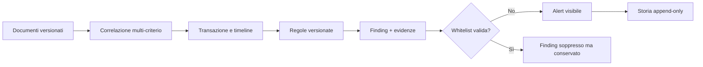

# Correlazione, alert e regole antifrode

## Modello operativo

Il motore è deterministico: stesso insieme ordinato di documenti, stessa
versione e stessi parametri producono lo stesso risultato. Non usa machine
learning né dati esterni impliciti.

## Correlazione spiegabile

La versione correttiva corrente è `rpg-correlation-1.4.0`. Il punteggio usa criteri
disponibili senza penalizzare automaticamente un campo assente. Tra i pesi
massimi:

| Criterio | Peso massimo |
|---|---:|
| codice ordine | 35 |
| riferimento embedded | 20 |
| codice documento | 15 |
| tavolo | 12 |
| prossimità temporale | 12 |
| similarità righe | 12 |
| importo | 8 |
| sequenza documento | 8 |
| operatore | 5 |
| stessa sessione | 0, sola provenienza tecnica |
| terminale | 4 |
| data operativa | 3 |
| dispositivo | 2 |

Il totale è limitato a 100. I documenti incompatibili o fuori finestra non
vengono uniti. Ogni correlazione conserva criteri soddisfatti/non soddisfatti,
spiegazione, versione algoritmo e membri originali.

Per le comande POS sono disponibili due criteri compositi e prudenti:

- `CROSS_DEPARTMENT_DISPATCH`: stesso tavolo, device POS differenti e massimo
  30 secondi, per riunire le viste BAR/CUCINA/PIZZERIA dello stesso invio;
- `SAME_TABLE_CHANGE_SEQUENCE`: stesso device e tavolo, variazione successiva
  entro 300 secondi e almeno un articolo comune per codice o descrizione.

I ticket dei reparti sono viste parziali simultanee, non snapshot successivi:
confrontarli tra loro non genera quindi falsi articoli aggiunti o rimossi.
Il limite di 30 secondi vale per l'intero gruppo, non per sole coppie adiacenti:
un ticket intermedio non può concatenare dispatch distinti. Codici ordine,
tavoli o riferimenti forti incompatibili bloccano il collegamento. Una nuova
comanda successiva a una chiusura fiscale/economica apre un nuovo episodio.

Copie conformi, ristampe, risposte RCH e rimborsi sono membri ausiliari: possono
arricchire la timeline appropriata ma non fanno da ponte tra due episodi. La
descrizione completa e gli esempi sono in
[Episodi di vendita](ANTIFRODE_EPISODI_VENDITA.md).

La sequenza tavolo viene collegata soltanto con criteri compositi. La comanda
precede la baseline gestionale entro 30 secondi con stessa riga; la chiusura
commerciale segue la baseline entro 300 secondi con stesso tavolo e articolo.
Un riferimento commerciale completo può confermare il Documento Commerciale;
un suffisso RCH è utilizzabile solo con provenienza status-sequence e gli altri
criteri concordanti. I progressivi propri gestionali e commerciali restano in
namespace distinti.

Il motore calcola `ADDED`, `REMOVED`, `QUANTITY_CHANGED`, `PRICE_CHANGED`,
`DISCOUNT_CHANGED` e `UNCHANGED`. Per i conti separati, il totale fiscale è la
somma dei Documenti Commerciali completi correlati. I rimborsi sono
aggiustamenti successivi e non riducono retroattivamente la vendita originale.
Il confronto avviene sul totale e sulle righe aggregate, non sul primo
documento arrivato.

Il worker `retailprintguard-correlate` legge l'ultima versione di ciascun
documento entro il limite, salva fingerprint di input, membri e criteri, crea o
aggiorna l'ordine e aggiunge eventi/snapshot con ID deterministici e catene hash.
Una seconda esecuzione sullo stesso input non duplica i record. Una
correlazione precedente interamente contenuta in un nuovo gruppo viene marcata
`SUPERSEDED`; i documenti sorgente restano invariati.

Le risposte RCH prive di codice ordine/documento possono entrare nella stessa
timeline soltanto tramite l'esatto `source_job_id`. Non esiste fallback basato
sulla sola sessione: una connessione RCH persistente può contenere vendite
distinte e non costituisce identità commerciale.

## Regole predefinite

| Codice | Default | Condizione principale |
|---|---|---|
| `MODIFICA_POST_PRECONTO` | HIGH, 20% e 1,00 € | diff righe/importo tra preconto e chiusura fiscale o economica validata |
| `PREBILL_FISCAL_AMOUNT_DROP` | HIGH, 20% e 1,00 € | preconto maggiore del fiscale aggregato |
| `ITEM_REMOVED_AFTER_PREBILL` | HIGH | riga presente prima e rimossa dopo |
| `PRICE_REDUCED_AFTER_PREBILL` | HIGH | prezzo unitario diminuito |
| `EXTREME_PRICE_CHANGE` | CRITICAL, 70% | riduzione percentuale estrema |
| `SAME_REFERENCE_DIFFERENT_AMOUNT` | HIGH, 1,00 € | riferimento condiviso e importi divergenti |
| `ORDER_WITHOUT_FISCAL_CLOSE` | MEDIUM, 120 min | sorgente senza fiscale entro finestra |
| `FISCAL_WITHOUT_SOURCE_ORDER` | MEDIUM | fiscale senza ordine/comanda/preconto |
| `EXCESSIVE_VOID_OR_CANCELLATION` | HIGH, 3 | annulli/rimozioni oltre soglia |
| `REPRINT_OR_COPY_ANOMALY` | MEDIUM, oltre 2 | copie/ristampe eccessive |
| `DOCUMENT_SEQUENCE_GAP` | HIGH | salto nella stessa serie/device/data/tipo |
| `DUPLICATE_DOCUMENT` | HIGH | codice o hash duplicato su job distinti |
| `LATE_ORDER_MODIFICATION` | HIGH, 5 min | modifica vicino alla chiusura fiscale |
| `NEGATIVE_OR_ZERO_VALUE_ITEM` | HIGH | riga non positiva fuori da annullo/rimborso |
| `TOTAL_LINE_MISMATCH` | HIGH, 0,01 € | somma righe incompatibile con totale |
| `PAYMENT_TOTAL_MISMATCH` | CRITICAL, 0,01 € | pagamenti incompatibili col fiscale |
| `UNUSUAL_OPERATOR_PATTERN` | MEDIUM, 20/30% | concentrazione su operatore identificato |

Le soglie sono default del codice, non una dichiarazione di frode. Devono
essere versionate e approvate per il contesto operativo. Il punteggio base viene
moltiplicato per il peso della regola e limitato a 0–100.

Il worker `retailprintguard-fraud` registra le definizioni/versioni mancanti,
verifica che il fingerprint della correlazione corrisponda ancora alle versioni
documento correnti e salva alert, evidenze RAW/documentali e prima voce della
storia nella stessa transazione. Il `finding_key` rende idempotente una seconda
valutazione identica. Una whitelist valida produce un alert `JUSTIFIED` con
motivazione e storia: non elimina il finding.

Quando `MODIFICA_POST_PRECONTO` descrive una riduzione economica, rimozioni e
riduzioni prezzo dello stesso episodio sono incluse come evidenza nello stesso
finding e non generano incidenti operativi aggiuntivi. La dashboard somma la
differenza massima una sola volta per transazione.

## Stati operativi e bonifica storica

Dashboard, stato transazione e vista operativa considerano gli alert canonici
in `OPEN`, `UNDER_REVIEW` o `CONFIRMED`. `FALSE_POSITIVE`, `JUSTIFIED`, `CLOSED`
e gli alert di correlazioni `SUPERSEDED` restano disponibili nella vista
archivio per audit.

La webapp apre la lista sulla vista operativa; archivio e vista completa devono
essere selezionati esplicitamente. Il drill-down dalle card economiche conserva
il periodo della dashboard e aggiunge tre vincoli: regola economica attiva,
chiusura osservata e differenza positiva. Un alert tecnico con un campo importo
non viene quindi contato come perdita di vendita.

Il worker riclassifica in modo idempotente alcuni alert prodotti dalla versione
precedente quando l'evidenza dimostra un difetto noto:

- `UNUSUAL_OPERATOR_PATTERN` calcolato con auto-amplificazione del proprio
  tasso diventa `FALSE_POSITIVE`;
- `DUPLICATE_DOCUMENT` assegnato a una transazione che non contiene alcuno dei
  documenti duplicati diventa `FALSE_POSITIVE`;
- duplicati costituiti esclusivamente da risposte dispositivo o copie di output
  diventano `FALSE_POSITIVE`, mentre duplicati commerciali reali restano
  operativi;
- righe tecniche a zero (`TOT`, `IVA`, `RESTO` e proiezioni equivalenti) non
  producono `NEGATIVE_OR_ZERO_VALUE_ITEM`; una voce di vendita a zero o negativa
  continua invece a essere segnalata;
- quando l'alert primario `MODIFICA_POST_PRECONTO` è attivo, i sintomi
  economici ausiliari dello stesso episodio vengono archiviati per evitare di
  moltiplicare evento e ammanco;
- un alert collegato a una correlazione sostituita da quella corrente diventa
  `JUSTIFIED`.

Ogni passaggio aggiunge motivazione, evidenza diagnostica e voce hash-chained in
`fraud_alert_history`; nessun alert viene eliminato.

## Scenari guida

### Riduzione sospetta

Preconto 100,00 €, riga rimossa/prezzo diminuito, Documento Commerciale 50,00 €:

- una transazione se i criteri superano la soglia;
- differenza assoluta 50,00 € e percentuale 50%;
- finding sul calo importo e, se dimostrati dai dati, su riga/prezzo;
- evidenze con documenti, righe prima/dopo, hash e riferimenti sorgente.

### Conto separato legittimo

Preconto 100,00 €, due Documenti Commerciali 50,00 € entrambi correlati:

- totale fiscale aggregato 100,00 €;
- differenza zero;
- nessun `PREBILL_FISCAL_AMOUNT_DROP`.

Se solo uno dei due documenti arriva entro la prima scansione, la valutazione
va ricalcolata quando arriva il secondo; gli alert non devono essere trattati
come verdetto definitivo durante una finestra incompleta.

## Workflow auditor

1. Aprire l'alert e leggere spiegazione/confidenza.
2. Verificare timeline e criteri di correlazione.
3. Confrontare righe e importi; distinguere dato osservato da inferenza.
4. Aprire i RAW solo con ruolo autorizzato; annotare il correlation ID.
5. Prendere in carico (`UNDER_REVIEW`).
6. Aggiungere note fattuali, senza copiare dati personali non necessari.
7. Concludere come `CONFIRMED`, `FALSE_POSITIVE`, `JUSTIFIED` o `CLOSED` con
   motivazione.

Ogni transizione deve apparire in `fraud_alert_history` e nell'audit. Non si
cancella il finding originale.

## Whitelist

Una whitelist richiede regola opzionale, scope, valore, motivo, inizio e fine
opzionale. Scope supportati: globale, transazione, dispositivo, operatore,
documento e riferimento. Un finding soppresso resta in `suppressed` con ID e
motivo della whitelist.

Evitare whitelist globali senza scadenza. L'uso consigliato è il perimetro più
stretto e una motivazione verificabile.

## Limiti interpretativi

- una correlazione alta non prova identità fisica della transazione;
- un alert non è una prova automatica di frode;
- “operatore” è usabile solo se il parser lo ha realmente identificato;
- i gap numerici possono derivare da perdita sorgente, cambio serie o apparati
  non osservati;
- documenti tardivi richiedono rielaborazione;
- la riclassificazione automatica copre soltanto i difetti legacy riconoscibili
  in modo deterministico; ogni altro falso positivo richiede revisione umana e
  motivazione esplicita.
