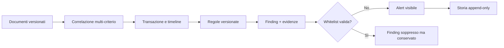

# Correlazione, alert e regole antifrode

## Modello operativo

Il motore è deterministico: stesso insieme ordinato di documenti, stessa
versione e stessi parametri producono lo stesso risultato. Non usa machine
learning né dati esterni impliciti.

## Correlazione spiegabile

La versione correttiva corrente è `rpg-correlation-1.1.0`. Il punteggio usa criteri
disponibili senza penalizzare automaticamente un campo assente. Tra i pesi
massimi:

| Criterio | Peso massimo |
|---|---:|
| codice ordine | 35 |
| riferimento embedded | 20 |
| codice documento | 15 |
| tavolo | 12 |
| prossimità temporale | 12 |
| similarità righe | 12 |
| importo | 8 |
| sequenza documento | 8 |
| operatore | 5 |
| stessa sessione | 5 |
| terminale | 4 |
| data operativa | 3 |
| dispositivo | 2 |

Il totale è limitato a 100. I documenti incompatibili o fuori finestra non
vengono uniti. Ogni correlazione conserva criteri soddisfatti/non soddisfatti,
spiegazione, versione algoritmo e membri originali.

Il motore calcola `ADDED`, `REMOVED`, `QUANTITY_CHANGED`, `PRICE_CHANGED`,
`DISCOUNT_CHANGED` e `UNCHANGED`. Per i conti separati, il totale fiscale è la
somma dei Documenti Commerciali/rimborsi correlati. Il confronto avviene sul
totale aggregato, non sul primo documento arrivato.

Il worker `retailprintguard-correlate` legge l'ultima versione di ciascun
documento entro il limite, salva fingerprint di input, membri e criteri, crea o
aggiorna l'ordine e aggiunge eventi/snapshot con ID deterministici e catene hash.
Una seconda esecuzione sullo stesso input non duplica i record. Una
correlazione precedente interamente contenuta in un nuovo gruppo viene marcata
`SUPERSEDED`; i documenti sorgente restano invariati.

Le risposte RCH prive di codice ordine/documento possono entrare nella stessa
timeline tramite l'esatto `source_job_id`; il fallback è limitato a stessa
sessione, stesso device e finestra temporale. Il primo è un legame tecnico
forte, il secondo resta un criterio temporale spiegabile e non una prova di
fiscalizzazione.

## Regole predefinite

| Codice | Default | Condizione principale |
|---|---|---|
| `MODIFICA_POST_PRECONTO` | HIGH, 20% e 1,00 € | diff righe/importo tra preconto e chiusura fiscale o economica validata |
| `PREBILL_FISCAL_AMOUNT_DROP` | HIGH, 20% e 1,00 € | preconto maggiore del fiscale aggregato |
| `ITEM_REMOVED_AFTER_PREBILL` | HIGH | riga presente prima e rimossa dopo |
| `PRICE_REDUCED_AFTER_PREBILL` | HIGH | prezzo unitario diminuito |
| `EXTREME_PRICE_CHANGE` | CRITICAL, 70% | riduzione percentuale estrema |
| `SAME_REFERENCE_DIFFERENT_AMOUNT` | HIGH, 1,00 € | riferimento condiviso e importi divergenti |
| `ORDER_WITHOUT_FISCAL_CLOSE` | MEDIUM, 120 min | sorgente senza fiscale entro finestra |
| `FISCAL_WITHOUT_SOURCE_ORDER` | MEDIUM | fiscale senza ordine/comanda/preconto |
| `EXCESSIVE_VOID_OR_CANCELLATION` | HIGH, 3 | annulli/rimozioni oltre soglia |
| `REPRINT_OR_COPY_ANOMALY` | MEDIUM, oltre 2 | copie/ristampe eccessive |
| `DOCUMENT_SEQUENCE_GAP` | HIGH | salto nella stessa serie/device/data/tipo |
| `DUPLICATE_DOCUMENT` | HIGH | codice o hash duplicato su job distinti |
| `LATE_ORDER_MODIFICATION` | HIGH, 5 min | modifica vicino alla chiusura fiscale |
| `NEGATIVE_OR_ZERO_VALUE_ITEM` | HIGH | riga non positiva fuori da annullo/rimborso |
| `TOTAL_LINE_MISMATCH` | HIGH, 0,01 € | somma righe incompatibile con totale |
| `PAYMENT_TOTAL_MISMATCH` | CRITICAL, 0,01 € | pagamenti incompatibili col fiscale |
| `UNUSUAL_OPERATOR_PATTERN` | MEDIUM, 20/30% | concentrazione su operatore identificato |

Le soglie sono default del codice, non una dichiarazione di frode. Devono
essere versionate e approvate per il contesto operativo. Il punteggio base viene
moltiplicato per il peso della regola e limitato a 0–100.

Il worker `retailprintguard-fraud` registra le definizioni/versioni mancanti,
verifica che il fingerprint della correlazione corrisponda ancora alle versioni
documento correnti e salva alert, evidenze RAW/documentali e prima voce della
storia nella stessa transazione. Il `finding_key` rende idempotente una seconda
valutazione identica. Una whitelist valida produce un alert `JUSTIFIED` con
motivazione e storia: non elimina il finding.

## Scenari guida

### Riduzione sospetta

Preconto 100,00 €, riga rimossa/prezzo diminuito, Documento Commerciale 50,00 €:

- una transazione se i criteri superano la soglia;
- differenza assoluta 50,00 € e percentuale 50%;
- finding sul calo importo e, se dimostrati dai dati, su riga/prezzo;
- evidenze con documenti, righe prima/dopo, hash e riferimenti sorgente.

### Conto separato legittimo

Preconto 100,00 €, due Documenti Commerciali 50,00 € entrambi correlati:

- totale fiscale aggregato 100,00 €;
- differenza zero;
- nessun `PREBILL_FISCAL_AMOUNT_DROP`.

Se solo uno dei due documenti arriva entro la prima scansione, la valutazione
va ricalcolata quando arriva il secondo; gli alert non devono essere trattati
come verdetto definitivo durante una finestra incompleta.

## Workflow auditor

1. Aprire l'alert e leggere spiegazione/confidenza.
2. Verificare timeline e criteri di correlazione.
3. Confrontare righe e importi; distinguere dato osservato da inferenza.
4. Aprire i RAW solo con ruolo autorizzato; annotare il correlation ID.
5. Prendere in carico (`UNDER_REVIEW`).
6. Aggiungere note fattuali, senza copiare dati personali non necessari.
7. Concludere come `CONFIRMED`, `FALSE_POSITIVE`, `JUSTIFIED` o `CLOSED` con
   motivazione.

Ogni transizione deve apparire in `fraud_alert_history` e nell'audit. Non si
cancella il finding originale.

## Whitelist

Una whitelist richiede regola opzionale, scope, valore, motivo, inizio e fine
opzionale. Scope supportati: globale, transazione, dispositivo, operatore,
documento e riferimento. Un finding soppresso resta in `suppressed` con ID e
motivo della whitelist.

Evitare whitelist globali senza scadenza. L'uso consigliato è il perimetro più
stretto e una motivazione verificabile.

## Limiti interpretativi

- una correlazione alta non prova identità fisica della transazione;
- un alert non è una prova automatica di frode;
- “operatore” è usabile solo se il parser lo ha realmente identificato;
- i gap numerici possono derivare da perdita sorgente, cambio serie o apparati
  non osservati;
- documenti tardivi richiedono rielaborazione;
- il worker persistente salva finding, evidenze e prima voce di storia in una
  transazione idempotente, ma il ricalcolo storico e la gestione automatica
  degli alert superseded richiedono ancora una policy operativa esplicita.
