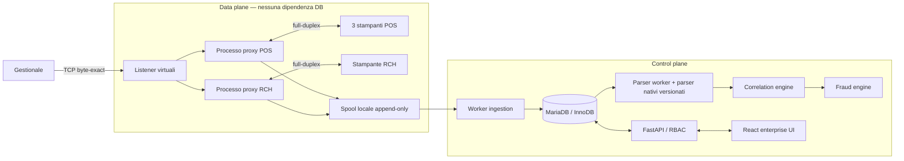
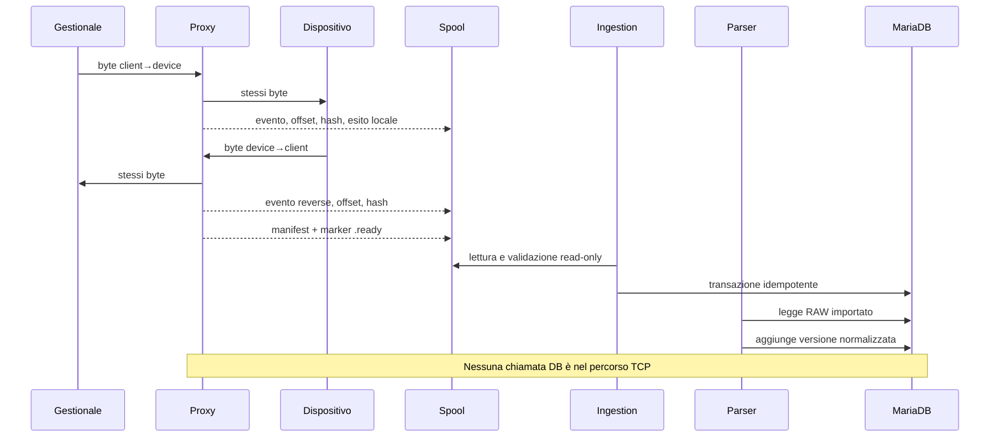
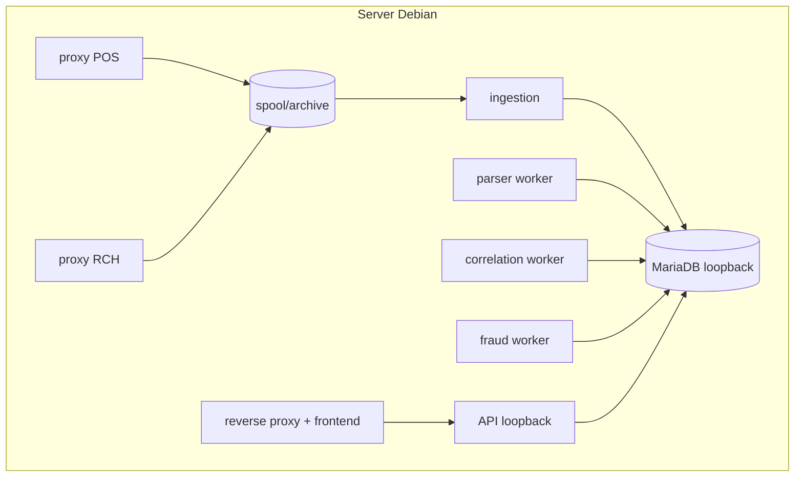

# Architettura

Per la distinzione fra release osservata e comportamento correttivo vedere
[DATA_FLOW_AS_IS.md](DATA_FLOW_AS_IS.md),
[DATA_FLOW_TO_BE.md](DATA_FLOW_TO_BE.md) e la decisione dettagliata
[ARCHITECTURE_DECISION_TRANSPORT.md](ARCHITECTURE_DECISION_TRANSPORT.md).

## Scelta

RetailPrintGuard è un monorepo modulare. Condivide dominio, configurazione,
modelli e contratti, ma mantiene processi distinti per POS proxy, RCH proxy,
ingestion, parser, correlazione, antifrode e API. Il confine di processo è una
proprietà di resilienza, non solo organizzazione del codice.

## Ordine delle operazioni nel data plane

Per ogni chunk osservato il relay:

1. legge da un endpoint TCP;
2. inoltra gli stessi byte all'altro endpoint con `write()` e `drain()`;
3. registra l'esito locale dell'inoltro;
4. propone un evento immutabile alla coda di cattura limitata;
5. prosegue con la normale backpressure di `asyncio`.

Il relay connette prima il target fisico e solo dopo inizia a leggere dal
client. In questo modo un target irraggiungibile non consuma un job per poi
accodarlo implicitamente. Il servizio gestisce FIN/half-close, timeout,
disconnessioni e chiusura controllata. Un solo client può usare un determinato
target alla volta; gli altri sono rifiutati senza attesa.

Il successo di `drain()` è una proprietà del socket locale, non prova di arrivo
fisico. Il manifest mantiene separati:

- `transport_complete`;
- `storage_complete`;
- byte/chunk osservati e catturati;
- errori e conteggi scartati.

Anche il logging è fuori dalla backpressure TCP: i processi pubblicano record
JSON su una coda in memoria bounded con `put_nowait`, mentre un listener separato
scrive su stderr/journald. La saturazione produce drop contati, non un'attesa
sincrona nel relay.

## Isolamento dai guasti

| Guasto | Effetto previsto |
|---|---|
| MariaDB offline | nessun impatto sul relay; ingestion ritenta e riscopre il job |
| API/frontend offline | nessun impatto su relay e spool |
| input/parser malformato | raw conservato; `UNKNOWN`, retry o `PARSE_FAILED`; nessun crash del proxy |
| stampante offline | fallisce solo la route/sessione interessata |
| coda cattura piena | policy `continue` marca evidenza incompleta; `abort` chiude la sessione |
| crash durante cattura | directory `.partial` recuperata come `PARTIAL`, senza inventare completezza |
| secondo client stesso target | rifiuto fail-fast; nessun interlacciamento |

La policy `continue` privilegia la continuità di stampa ma può produrre evidenza
incompleta. La policy `abort` privilegia la completezza dell'evidenza a costo di
interrompere la sessione interessata. È una decisione di rischio esplicita da
approvare per il sito.

POS e RCH sono anche separati a livello di identità Linux:
`retailprintguard-pos-proxy` e `retailprintguard-rch-proxy`. Entrambi possono
scrivere nello spool condiviso tramite il gruppo dedicato, ma non ricevono URL
DB o segreto JWT. Un problema o una compromissione di una famiglia non concede
automaticamente l'identità primaria dell'altra.

## Pipeline dati

## Confini tra livelli

### Capture envelope

Rappresenta un job pubblicato: provenienza, sessione, endpoint, payload per
direzione, timeline, completezza, hash e percorso sorgente. Non contiene
un'interpretazione fiscale.

### Normalized document

Rappresenta il risultato di un parser specifico e versionato: tipo, riferimenti,
righe, importi, pagamenti, confidenza, warning e span nel payload. Ogni nuova
elaborazione crea una `document_version`.

I parser nativi `retailprintguard-escpos` `1.2.0` e
`retailprintguard-rch-observed` `1.1.0` operano nel control plane:
ricevono byte e metadati già acquisiti e restituiscono documenti immutabili.
Non aprono socket, non modificano lo spool e non importano il relay. La
segmentazione applicativa avviene sul flusso ricostruito, mai sui confini delle
letture TCP.

L'OCR opzionale del tavolo ESC/POS viene eseguito soltanto dal worker parser
con risorse bounded e isolamento systemd. Versione/lingua del backend entrano
nel fingerprint della build; un errore OCR non cambia la disponibilità del
proxy né i byte acquisiti.

### Correlated transaction

Raggruppa documenti compatibili tramite criteri ponderati. Mantiene membri,
punteggio, criteri soddisfatti/non soddisfatti, algoritmo e timeline. Non fonde
né cancella i documenti sorgente.

### Fraud finding

È l'esito di una regola versionata su una transazione: severità, score,
confidenza, spiegazione ed evidenze. La gestione umana dell'alert genera storia
append-only.

## Correlazione

L'algoritmo correttivo `rpg-correlation-1.3.0` usa, quando disponibili, codice
ordine, codice documento, riferimenti embedded, tavolo, operatore, terminale,
data operativa, prossimità temporale, totale, similarità righe,
sequenza e dispositivo. I gruppi sono deterministici e il punteggio è limitato
a 100. La sessione TCP resta provenienza tecnica a peso zero e non rappresenta
l'identità della vendita. Conflitti espliciti di ordine/tavolo/riferimento e una
chiusura economica precedente costituiscono confini rigidi dell'episodio.

I documenti fiscali multipli vengono aggregati prima di calcolare la differenza
dal preconto. Un preconto da 100,00 € seguito da due documenti da 50,00 € può
quindi essere riconosciuto come conto separato senza falso calo, se gli altri
criteri supportano la correlazione.

Il worker persiste un watermark e carica nuovi documenti/late arrival con
lookback. La ricerca SQL del vicinato è bloccata su chiavi indicizzate (ordine,
codice esterno, tavolo o sessione) e finestra temporale; il limite CLI si
applica ai seed. L'antifrode carica i membri delle correlazioni selezionate e
solo confronti con stesso codice esterno/device entro un giorno, evitando una
scansione in memoria dell'intero archivio a ogni ciclo.

Una `DEVICE_RESPONSE` RCH senza riferimenti business può collegarsi soltanto
tramite lo stesso `source_job_id` duplex. In assenza di quel legame resta
separata: una sessione persistente non può unire ricevute differenti. Copie,
ristampe, risposte e rimborsi sono membri ausiliari non colleganti.

Il servizio pricing del control plane aggiunge attribuzioni append-only alle
righe POS prive di prezzo, usando soltanto righe monetarie correlate di
versioni complete di preconto, Documento Gestionale o Commerciale. Ogni
attribuzione conserva
versione algoritmo, riga/versione sorgente, criterio, confidenza e ambiguità;
non modifica `document_lines` né RAW. Fonti discordanti restano visibili e non
producono un prezzo derivato selezionato. Vedere
[Episodi di vendita](ANTIFRODE_EPISODI_VENDITA.md).

La scelta dell'interpretazione usa `active_parser_versions`: se manca il
puntatore prevale la sequenza più recente, mentre un puntatore può selezionare
una build precedente senza cancellare le nuove. L'attivazione deve coordinare
watermark e ricalcolo tramite il comando transazionale di correlazione; vedere
[Aggiornamento parser](AGGIORNAMENTO_PARSER.md). La motivazione corrente resta
sul puntatore e ogni cambio produce evento tecnico e audit hash-chained. La CLI
locale non ha un principal autenticato, quindi l'actor DB è nullo e va collegato
alla change operativa.

## Deployment logico

Ogni worker legge dal database e scrive risultati transazionali; non importa il
relay e non accede ai socket di stampa. L'ordinamento operativo è ingestion →
parser → correlazione → antifrode. Un servizio è dichiarato operativo solo
se entry point, unità, migrazioni e test della stessa release sono coerenti;
vedere [Installazione Debian](INSTALLAZIONE_DEBIAN.md) e
[Limiti noti](LIMITI_NOTI.md).

## Perché non due code o un broker esterno

Per il volume previsto, lo spool filesystem è il journal durevole tra data e
control plane. Aggiungere Redis, RabbitMQ o Kafka introdurrebbe più componenti
sincroni e procedure di recovery senza eliminare la necessità dello spool
locale. Il contratto repository consente comunque di evolvere i worker senza
modificare il relay.

## Diagrammi collegati

- schema entità: [DATABASE.md](DATABASE.md)
- stati import: [IMPORT_STORICO.md](IMPORT_STORICO.md)
- timeline e alert: [ALERT_E_REGOLE.md](ALERT_E_REGOLE.md)
- decisioni e alternative: [ADR.md](ADR.md)
