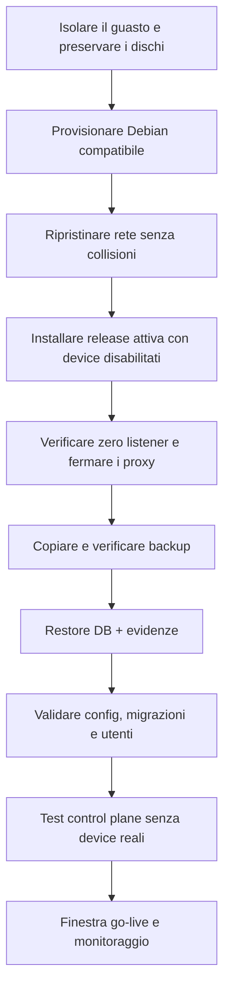

# Backup, restore e disaster recovery

## Backup supportato

```bash
sudo /opt/retailprintguard/current/scripts/backup.sh
```

L'installazione abilita anche `retailprintguard-backup.timer`: pianificazione
giornaliera alle 02:17 ora locale del server, ritardo casuale fino a 20 minuti
e recupero dell'esecuzione persa dopo uno spegnimento (`Persistent=yes`).
Verificarlo con:

```bash
systemctl status retailprintguard-backup.timer --no-pager
systemctl list-timers retailprintguard-backup.timer --no-pager
```

La presenza del timer non prova che l'ultimo backup sia riuscito: controllare
anche `retailprintguard-backup.service`, journald e l'archivio prodotto.
La unità oneshot conserva un bounding set di capability vuoto e riceve il solo
gruppo supplementare `retailprintguard-spool`, necessario per leggere le
evidenze pubblicate senza allargare i permessi dei file.

Per una destinazione esplicita non esistente:

```bash
sudo /opt/retailprintguard/current/scripts/backup.sh \
  --output /var/backups/retailprintguard/backup-manuale.tar.gz
```

Il comando acquisisce un lock di manutenzione e crea:

- dump MariaDB `--single-transaction --quick` compresso;
- configurazione e segreti presenti in `/etc/retailprintguard`;
- job spool pubblicati con `.ready`;
- archivio, escludendo directory `*.partial`;
- riferimenti alle release codice/web correnti;
- `MANIFEST.sha256` di tutti i file.

Lo staging dell'archivio è intenzionalmente root-owned: contenuti e timestamp
vengono conservati, UID/GID sorgenti non vengono replicati e i mode delle sole
evidenze sono normalizzati a `0750` per le directory e `0640` per i file. Questo
mantiene operativo il backup nell'unità systemd senza `CAP_CHOWN` e con
`RestrictSUIDSGID=yes`; durante il restore le identità locali dei proxy e dei
worker vengono applicate esplicitamente dopo la verifica delle collisioni e
degli hash.

Le sessioni proxy possono continuare: i job attivi `.partial` non entrano nel
backup e saranno inclusi dopo la pubblicazione in quello successivo.

Il tar gzip è `0600` ma **non cifrato**. Trasferirlo su storage cifrato e
separato; proteggere anche la chiave HMAC printproxy, che può trovarsi fuori dai
percorsi inclusi.

## Verifica del backup

La verifica più affidabile è un restore su host/database isolato. Prima del
trasferimento si può almeno controllare l'archivio senza estrarlo in produzione:

```bash
tar -tzf /var/backups/retailprintguard/backup-manuale.tar.gz | head
sha256sum /var/backups/retailprintguard/backup-manuale.tar.gz
```

Registrare hash, dimensione, ora UTC, host, release, custode e destinazione.
Il manifest interno viene verificato automaticamente da `restore.sh`.

## Restore supportato

Il restore database è deliberatamente distruttivo e richiede conferma esplicita:

```bash
sudo /opt/retailprintguard/current/scripts/restore.sh \
  --archive /var/backups/retailprintguard/backup-manuale.tar.gz \
  --confirm-destructive-database-restore
```

Il comando:

1. rifiuta symlink e membri tar assoluti, traversal, link o device;
2. crea un backup di sicurezza corrente;
3. verifica `MANIFEST.sha256`;
4. ferma ingestion/parser/correlation/fraud/API, non i proxy;
5. elimina e ricrea solo il database applicativo;
6. importa il dump;
7. unisce spool/archive con `--ignore-existing`;
8. riapplica le migrazioni della release corrente;
9. riavvia i servizi control plane abilitati.

Le copie di configurazione/segreti contenute nel bundle non sovrascrivono
automaticamente `/etc`; questo evita di sostituire credenziali locali senza
coordinare l'account MariaDB. Un ripristino di config/JWT/HMAC è una decisione
separata e manuale.

## Test restore trimestrale

1. Provisionare un host isolato senza accesso alle stampanti reali.
2. Preparare una configurazione DR con gli stessi ID/tipi di device ma tutti i
   device `enabled: false`; non assegnare gli IP virtuali di produzione.
3. Installare e **attivare** una release compatibile con `install.sh`: il
   restore usa `/opt/retailprintguard/current` per validatore e Alembic. Non
   usare `--no-start` su un host nuovo, perché tale modalità lascia
   intenzionalmente assente il symlink `current`.
4. Verificare che i due proxy non abbiano listener e fermarli esplicitamente
   per tutta la prova (`systemctl stop retailprintguard-pos-proxy.service
   retailprintguard-rch-proxy.service`).
5. Copiare il backup tramite canale protetto.
6. Eseguire restore e verificare hash/contatori.
7. Avviare soltanto API/control plane; i device restano disabilitati.
8. Confrontare conteggi DB, campione raw e catene.
9. Eseguire una seconda ingestion del campione: zero duplicati logici.
10. Documentare RTO/RPO ed eliminare in modo approvato l'ambiente temporaneo.

`--no-start` è adatto allo staging di una release su un'installazione già
attiva, non al bootstrap di un host DR che deve eseguire `restore.sh`.

## Disaster recovery host perso



Non assegnare gli IP del vecchio host mentre quello originale può ancora essere
online. La configurazione degli indirizzi non è eseguita dall'installer.

## RPO e retention

Il RPO database dipende dalla frequenza backup; il RAW pubblicato dopo l'ultimo
backup può essere recuperato dallo spool sopravvissuto e reimportato. Se si perde
anche il disco spool, tale evidenza non è ricostruibile dalla stampante.

Definire:

- backup giornaliero e dopo ogni release/migrazione;
- copie off-host e almeno una offline/immutabile;
- periodo compatibile con privacy e obblighi fiscali;
- monitoraggio esito/job backup;
- rotazione che non cancelli l'unica copia valida.

## Rollback applicativo vs restore

`rollback.sh` cambia atomically i symlink dell'applicazione e del frontend
abbinato, quindi riavvia i servizi; non esegue downgrade database. Usarlo solo
se la release precedente è compatibile con lo schema corrente.

Il restore ripristina dati/schema da backup ed è più invasivo. Non usare
`alembic downgrade` in produzione come scorciatoia senza una migrazione inversa
verificata e un backup restaurabile.
