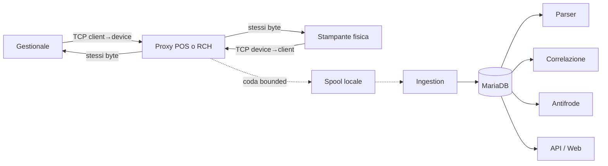

# Flusso dati rilevato (as-is)

Questo documento descrive la release osservata durante l'incidente, non il
worktree correttivo ancora da distribuire.

## Percorso critico

La linea continua è il data plane; le linee tratteggiate e il database sono il
control plane. Database, parser e web non partecipano all'inoltro.

## Sessione TCP

1. il listener accetta una connessione autorizzata;
2. il proxy apre il target configurato;
3. due pompe asincrone leggono e scrivono in direzioni opposte;
4. ogni chunk riceve timestamp, direzione, offset e stato di forwarding;
5. il capture writer pubblica RAW/timeline/manifest e `.ready`;
6. il proxy gestisce EOF e half-close senza interpretare il payload;
7. ingestion legge soltanto job pubblicati.

## Comportamenti rischiosi rilevati nel codice as-is

- la finestra di reverse tail era assoluta: traffico progressivo ma tardivo
  poteva essere tagliato allo scadere del timer iniziale;
- un timeout/errore durante `drain()` poteva restituire il lock del target prima
  dell'abort sincrono del vecchio trasporto;
- la sequenza osservata veniva assegnata prima del `drain`, ma persistita dopo,
  rendendo possibile l'ordine fisico inverso nella timeline;
- l'apertura di un endpoint capture speciale poteva bloccare il data plane;
- in recovery, una divergenza tra RAW e timeline poteva essere marcata come
  `storage_complete=true`;
- la cache dei job pubblicati non aveva un limite esplicito di crescita;
- l'antifrode inseriva duplicati per dati invariati perché un timestamp volatile
  entrava nel fingerprint;
- ingestion poteva persistere un batch anche quando tutti i candidati erano già
  importati.

## Evidenza dell'incidente rispetto a questi rischi

Nel campione privato non sono stati rilevati reverse tail persi, transport
sovrapposti, timeline fuori ordine, job incompleti marcati completi o replay del
proxy. Tali difetti sono quindi rischi reali della release, ma non una causa
dimostrata della sequenza RCH esaminata.

Il duplicato antifrode e i batch amministrativi ripetuti sono invece stati
osservati. La mitigazione ha fermato solo il worker antifrode, lasciando il
forwarding attivo.

## Confini di affidabilità

- `writer.write()` + `drain()` completato significa avanzamento nel socket
  locale, non ricezione fisica né stampa;
- `.ready` significa pubblicazione atomica del job locale, non correttezza
  semantica del documento;
- hash e catene rilevano modifiche rispetto a un head affidabile, ma non
  resistono a un root ostile che riscrive entrambi;
- la fotografia è un riscontro visivo, non una cattura di protocollo.

Il flusso correttivo è in [DATA_FLOW_TO_BE.md](DATA_FLOW_TO_BE.md).
