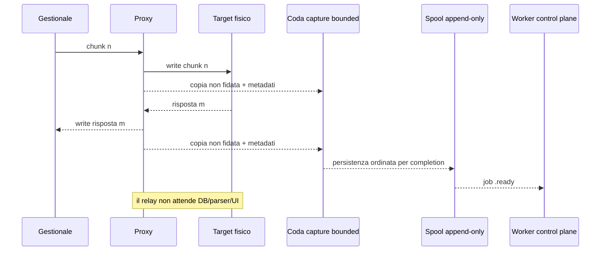

# Flusso dati corretto (to-be)

Il flusso seguente rappresenta il comportamento atteso dalla release
correttiva. Diventa stato di produzione solo dopo i gate di
[TEST_PLAN.md](TEST_PLAN.md) e un deployment autorizzato.

## Invarianti

1. Il payload inoltrato è byte-identico e nello stesso ordine per direzione.
2. Parsing, DB, antifrode, API e UI non possono bloccare il relay.
3. Ogni errore di cattura segue una policy esplicita `continue` o `abort`.
4. Un job incompleto non viene mai dichiarato completo.
5. Una scansione invariata non crea nuovi documenti, batch o alert.

## Percorso corretto

## Correzioni del data plane

- il reverse tail usa timeout di **inattività** e si rinnova quando arrivano
  byte;
- su errore/timeout di write, il trasporto viene abortito prima di liberare il
  lock del target;
- `observed_sequence` conserva l'ordine di lettura, mentre `sequence` descrive
  l'ordine di completion/enqueue persistito; la validazione impone unicità e
  insieme esatto;
- endpoint capture non ordinari sono aperti in modalità non bloccante e bounded;
- la policy `continue` può rinunciare alla cattura in caso di saturazione, ma
  registra il fallimento e non rallenta il relay;
- una recovery con divergenza RAW/timeline pubblica un job `PARTIAL`, conserva
  l'intero RAW disponibile, marca `storage_complete=false` e documenta il
  prefisso coperto;
- la memoria dei job pubblicati è limitata.

## Pipeline control plane

1. ingestion verifica schema, path, dimensioni, hash, timeline e idempotency
   key;
2. una scansione composta solo da duplicati non genera un nuovo batch;
3. parser puri e bounded producono versioni append-only;
4. correlazione usa più criteri, aggrega chiusure fiscali separate e mantiene
   gli esiti economici non fiscali distinti;
5. antifrode valuta regole versionate con fingerprint stabile;
6. un secondo ciclo sugli stessi dati produce zero nuovi alert;
7. i duplicati storici restano disponibili ma sono superseded, non cancellati;
8. API e UI mostrano per default i record operativi canonici e consentono
   l'accesso auditato alla storia.

## Degrado controllato

| Guasto | Comportamento atteso |
|---|---|
| MariaDB offline | relay attivo, job nello spool, retry ingestion |
| parser malformato | RAW conservato, warning/versione fallita, nessun crash proxy |
| API/UI offline | relay e worker indipendenti |
| coda capture piena + `continue` | forwarding prioritario, evidenza `PARTIAL`/evento tecnico |
| coda capture piena + `abort` | sola sessione interessata chiusa, errore conservato |
| target lento | backpressure TCP bounded; nessuna crescita RAM illimitata |
| riavvio processo | recovery spool, nessun import duplicato |

## Gate di attivazione

- suite Python e frontend completamente verdi;
- test offline di segmentazione, aggregazione, half-close e reverse tail;
- doppia esecuzione ingestion/fraud idempotente;
- migrazione MariaDB verificata su copia del DB;
- backup e restore provati;
- test hardware solo in finestra separata e autorizzata;
- proxy non riavviati durante l'analisi forense.
