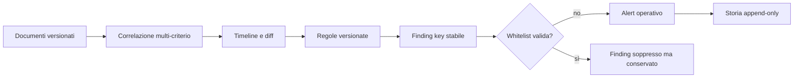

# Modello di rilevamento antifrode

## Principi

Il motore è deterministico, spiegabile e ricalcolabile. Non attribuisce dolo e
non usa machine learning obbligatorio. Ogni finding deriva da una regola
versionata, parametri, transazione normalizzata ed evidenze leggibili.

Identici input ordinati, stessa versione e stessi parametri devono produrre lo
stesso fingerprint. Timestamp di polling, correlation ID di processo o altre
informazioni volatili non fanno parte dell'identità logica.

## Pipeline

## Regole

Il catalogo predefinito comprende le sedici regole richieste dal capitolato e
la regola composita `MODIFICA_POST_PRECONTO`. L'elenco e le soglie correnti sono
in [ALERT_E_REGOLE.md](ALERT_E_REGOLE.md).

`MODIFICA_POST_PRECONTO` apre un finding quando, dopo un preconto, esiste una
chiusura fiscale completa oppure un esito economico gestionale validato e sono
presenti riduzioni di righe/prezzi o una diminuzione oltre soglia. Conserva:

- totale preconto e totale finale osservato;
- differenza assoluta e percentuale;
- tipo di chiusura usata;
- righe aggiunte, rimosse e modificate;
- documenti, job e RAW collegati;
- criteri di correlazione e confidenza.

Tentativi fiscali annullati o incompleti non valgono come totale fiscale
positivo. Più Documenti Commerciali completi correlati vengono aggregati: un
preconto da 100,00 € chiuso con due documenti da 50,00 € non produce un alert di
riduzione.

## Score e severità

Lo score 0–100 combina severità base, ampiezza economica, qualità della
correlazione e specificità dell'evidenza. Il punteggio non è una probabilità di
frode. Un alert con confidenza bassa deve mostrare quali criteri mancano.

Stati operativi: `OPEN`, `UNDER_REVIEW`, `CONFIRMED`, `FALSE_POSITIVE`,
`JUSTIFIED`, `CLOSED`. Note, assegnazione, motivazione di chiusura e passaggi di
stato sono storicizzati.

## Whitelist

Una whitelist ha scope, motivo, autore, validità e regola opzionale. Sopprime la
visibilità operativa del finding ma non cancella documento, evento o evidenza.
Una whitelist globale richiede un valore esplicito e non può essere dedotta da
un singolo falso positivo.

## Idempotenza e deduplica storica

Il test minimo esegue due cicli consecutivi su una transazione ormai oltre la
finestra temporale:

- primo ciclo: inserimento atteso;
- secondo ciclo: `inserted=0`, finding riconosciuto come esistente.

I duplicati prodotti da una release precedente devono restare nel DB per audit,
marcati come superseded rispetto all'alert canonico. Non vanno eliminati con SQL
ad hoc. Dashboard e liste operative escludono i superseded per default, mentre
la vista tecnica può consultarli.

## Caso incidente

Per la sequenza 35,00 €→5,00 €, la regola composita deve riportare 30,00 € e
`85,7143%`, il diff delle righe e il fatto che la chiusura osservata è economica
ma non necessariamente fiscale. Gli status RCH e i tentativi annullati sono
evidenze, non importi incassati.

## Limiti

- senza operatore realmente identificato non si applica un pattern nominale;
- clock skew e documenti mancanti riducono la confidenza;
- correlazione non equivale a causalità;
- l'alert richiede revisione umana e fonti esterne prima di qualsiasi
  attribuzione disciplinare o legale.
