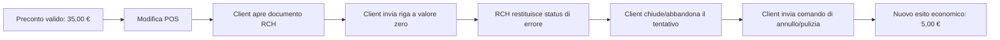

# Analisi della causa

## Dichiarazione della causa

Per l'incidente osservato, la causa più prossima supportata dai dati è una
sequenza di comandi applicativi client che include una riga a prezzo zero,
seguita da uno status d'errore RCH e da comandi espliciti di annullo/pulizia e
nuovi tentativi. Non vi è evidenza che il proxy abbia creato, modificato,
troncato o riemesso quei comandi.

Il significato preciso dello status RCH è **non confermato**: il rapporto non
inventa una mappatura di protocollo. La causa a monte — logica del gestionale,
input operatore, configurazione articolo o regola firmware — richiede evidenze
del gestionale e documentazione vendor.

## Catena causale osservata

## Perché il proxy non è indicato come causa dell'incidente

1. I frame problematici sono presenti nel RAW client→RCH.
2. Le quattro occorrenze appartengono a sessioni client distinte.
3. La riga a zero precede in modo deterministico la risposta di errore.
4. I comandi di annullo/pulizia provengono dal client.
5. Hash, offset, ordine, BCC e pairing request/response risultano coerenti nel
   campione.
6. Non sono stati osservati drop, duplicazioni o errori di forwarding.

La conclusione è limitata al campione e non equivale a una certificazione del
relay su ogni condizione di rete.

## Difetti software distinti dall'incidente

La code review ha comunque rilevato rischi reali:

| Area | Difetto pre-correzione | Impatto potenziale | Relazione con l'incidente |
|---|---|---|---|
| reverse tail | timeout assoluto invece che idle-resetting | perdita di una coda tardiva | non osservato |
| drain/error | trasporto precedente non abortito prima del rilascio lock | sovrapposizione su target condiviso | non osservato |
| sequenza spool | sequenza assegnata prima del `drain`, persistenza dopo | timeline fuori ordine/reject ingestion | non osservato |
| apertura capture | apertura FIFO potenzialmente lenta/bloccante | ritardo al data plane | non osservato |
| recovery | divergenza RAW/timeline marcata completa | evidenza incompleta dichiarata valida | non osservato |
| antifrode | timestamp dinamico nel fingerprint | alert duplicati a ogni polling | osservato in produzione |
| ingestion | batch persistito anche per scansioni solo-duplicati | crescita amministrativa inutile | osservato in produzione |

Le correzioni di relay/spool sono preventive e vanno validate offline prima del
deployment. La correzione del fingerprint deve precedere la riattivazione del
worker antifrode.

## Cinque perché del duplicato antifrode

1. **Perché crescevano gli alert?** Ogni polling inseriva nuove righe per la
   stessa transazione.
2. **Perché l'unicità non le bloccava?** Il `finding_key` risultava differente.
3. **Perché cambiava?** L'evidenza fingerprintata includeva l'ora corrente di
   valutazione.
4. **Perché un dato volatile era nel fingerprint?** Evidenza descrittiva e
   identità logica non avevano un confine sufficientemente esplicito.
5. **Perché il test non lo rilevava?** Mancava un test che eseguisse due cicli
   sugli stessi dati maturi e imponesse zero nuovi alert al secondo ciclo.

## Azioni correttive

- rendere stabile l'evidenza identitaria della regola temporale;
- aggiungere test di doppia esecuzione e concorrenza;
- preservare i duplicati storici, marcandoli come superseded con riferimento al
  record canonico anziché cancellarli;
- non mostrare i record superseded nei conteggi operativi predefiniti;
- non creare `import_batches` per una scansione che contiene solo duplicati;
- monitorare separatamente `evaluated`, `inserted`, `duplicate` e dimensione DB;
- mantenere il data plane indipendente da questi worker.

## Responsabilità non attribuibili

Il sistema può segnalare una differenza economica e ricostruire i comandi, ma
non può stabilire da solo frode, dolo o identità dell'operatore. Ogni alert resta
un elemento da revisionare con log del gestionale, documentazione fiscale e
procedure aziendali.
